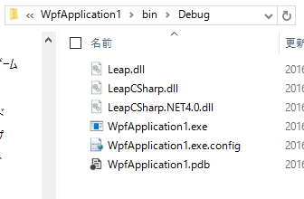

## Monsoon.Setup

The NuGet packages for the initial setup (DLL references, etc.).

- [NuGet Gallery | Monsoon.Setup.Leap1](https://www.nuget.org/packages/Monsoon.Setup.Leap1/)
- [NuGet Gallery | Monsoon.Setup.Leap2](https://www.nuget.org/packages/Monsoon.Setup.Leap2/)

### For Leap Motion SDK
Adds references for Leap Motion SDK to the project.  
In addition, Use [Monsoon.Reactive](https://github.com/sakapon/Monsoon.Reactive) for reactive programming.

#### Monsoon.Setup.Leap1
Adds references for Leap Motion SDK 1.2.0 (Leap.dll, LeapCSharp.dll, LeapCSharp.NET4.0.dll).  
To install [Monsoon.Setup.Leap1](https://www.nuget.org/packages/Monsoon.Setup.Leap1/), run the following command in the Package Manager Console on Visual Studio:

```
Install-Package Monsoon.Setup.Leap1
```

#### Monsoon.Setup.Leap2
Adds references for Leap Motion SDK 2.3.1 (Leap.dll, LeapCSharp.dll, LeapCSharp.NET4.0.dll).  
To install [Monsoon.Setup.Leap2](https://www.nuget.org/packages/Monsoon.Setup.Leap2/), run the following command in the Package Manager Console on Visual Studio:

```
Install-Package Monsoon.Setup.Leap2
```

#### Screen shots
A project on Visual Studio and the built bin\Debug folder:  


